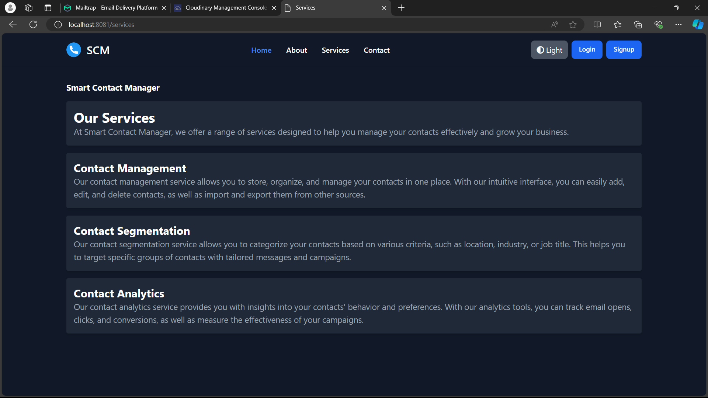
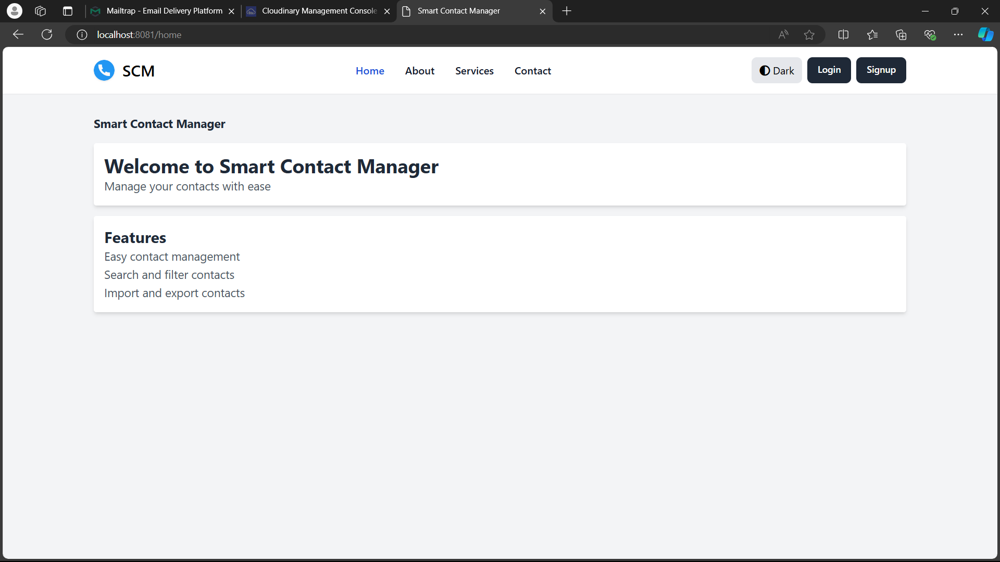
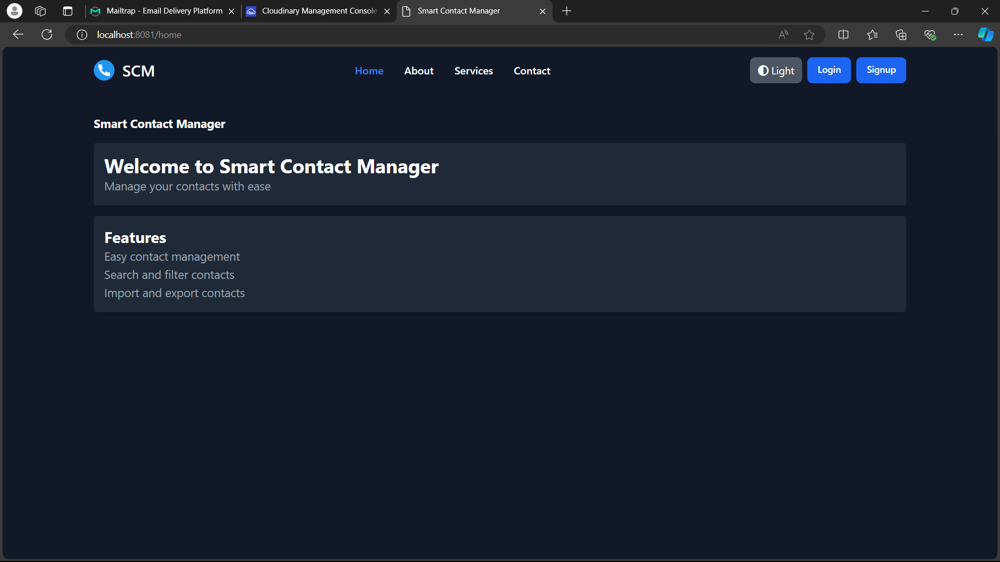
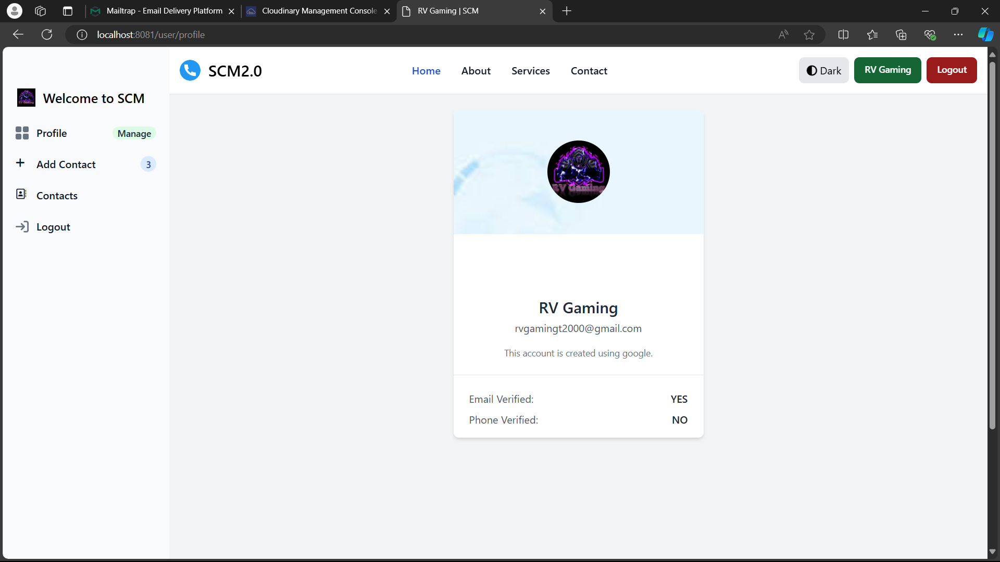

# Smart Contact Manager (SCM2.0)

A modern, feature-rich contact management application built with Spring Boot and modern web technologies.

## Features

- **User Authentication**
  - Email/Password login
  - Google OAuth integration
  - GitHub OAuth integration
  - User registration with email verification
  - Secure user profiles

- **Contact Management**
  - Add, edit, and delete contacts
  - Search and filter contacts
  - Import and export contacts
  - Contact categorization and segmentation

- **User Interface**
  - Modern, responsive design
  - Dark/Light mode toggle
  - Intuitive navigation
  - Mobile-friendly layout

- **Other Features**
  - Contact analytics
  - Profile management
  - Contact links (social media, etc.)

## Technology Stack

- **Backend**
  - Java Spring Boot
  - Spring Security
  - Spring Data JPA
  - Hibernate
  - OAuth2 for Google and GitHub integration

- **Frontend**
  - Thymeleaf templates
  - HTML/CSS/JavaScript
  - Tailwind CSS for styling
  - Responsive design

- **Database**
  - MySQL/PostgreSQL

## Getting Started

### Prerequisites

- JDK 11 or higher
- Maven
- MySQL/PostgreSQL database
- Node.js and npm (for frontend assets)

### Installation

1. Clone the repository:
   ```
   git clone https://github.com/yourusername/scm2.0.git
   cd scm2.0
   ```

2. Configure the database:
   - Create a database for the application
   - Update `src/main/resources/application.properties` with your database credentials

3. Configure OAuth (optional):
   - Create OAuth credentials for Google and/or GitHub
   - Update the application configuration with your OAuth credentials

4. Build and run the application:
   ```
   mvn clean install
   mvn spring-boot:run
   ```

5. Access the application at `http://localhost:8081`

## Application Structure

- `src/main/java/com/scm/` - Java source code
  - `controllers/` - API and view controllers
  - `entities/` - JPA entity classes
  - `repositories/` - Spring Data repositories
  - `services/` - Business logic services
  - `config/` - Application configuration
  - `validators/` - Input validation
  - `helpers/` - Utility classes

- `src/main/resources/` - Application resources
  - `templates/` - Thymeleaf templates
  - `static/` - Static resources (CSS, JS, images)

## Screenshots

Below are screenshots of the Smart Contact Manager application:

### Home Page
The landing page of the application with features overview.



### Login Page
User authentication with email/password and social login options (Google, GitHub).



### Contact List
View and manage all your contacts with search and filtering capabilities.



### User Profile
User profile management with account settings and preferences.



## Team

- Rohit Verma - Project Manager and Developer
- Manish Kumar - Documentation and Designer

## Design Resources

### Canvas Link:
https://excalidraw.com/#json=SIuQrQnGQr9DGkCVc8BWD,JqVceoohF0UsTfllkzdRmw

## License

[MIT License](LICENSE)
